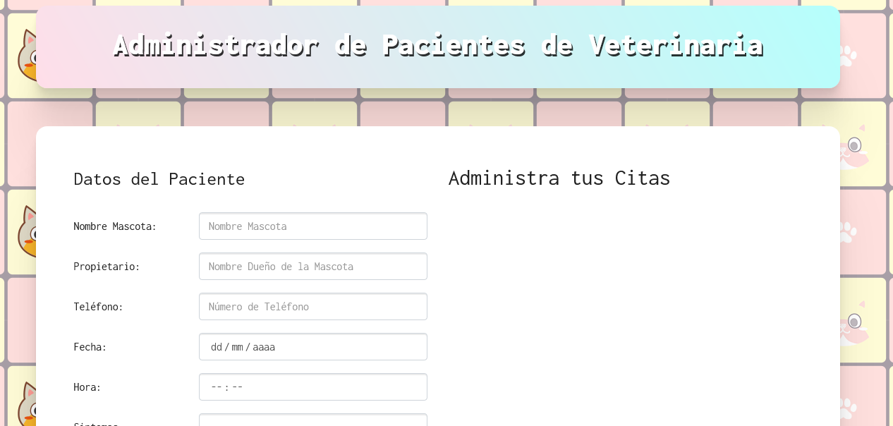

# Gestor de citas App

## Table of contents

- [Description](#description)
- [Screenshot](#screenshot)
- [Built with](#built-with)
- [Links](#links)
- [Author](#author)

## Description

Single page application to manage vet appointment.

## Screenshot

## Built with

Made with HTML, CSS, Bootstrap and Javascript (using classes and modules).

## Links

[Live Demo]()

## Author

[Marcos Pennachini](https://www.linkedin.com/in/marcos-pennachini-b39898123/)

One of many projects from [Udemy Course](https://www.udemy.com/course/javascript-moderno-guia-definitiva-construye-10-proyectos/)
